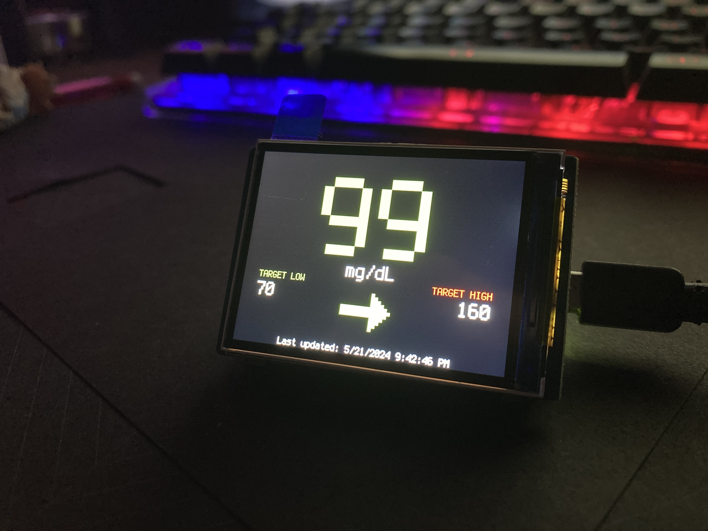

# Glucose Monitor Display with Raspberry Pi Pico W and Waveshare 2" IPS Screen

This project uses a Raspberry Pi Pico W and a Waveshare 2" IPS screen to display glucose levels from the Freestyle Libre continuous glucose monitor (CGM). The project is built using CircuitPython.

## Table of Contents
- [Introduction](#introduction)
- [Features](#features)
- [Hardware Requirements](#hardware-requirements)
- [Software Requirements](#software-requirements)
- [Setup Instructions](#setup-instructions)
- [Usage](#usage)
- [Contributing](#contributing)
- [License](#license)

## Introduction
This project provides a simple and effective way to continuously monitor and display glucose levels from the Freestyle Libre CGM on a small IPS screen using a Raspberry Pi Pico W. The project is written in CircuitPython, making it easy to modify and extend.



## Features
- Displays real-time glucose levels from the Freestyle Libre CGM using the LibreLinkUp API
- Easy-to-read display with Waveshare 2" IPS screen.
- Wireless data fetching via Raspberry Pi Pico W.
- Simple and customizable codebase.

## Hardware Requirements
- [Raspberry Pi Pico W](https://www.raspberrypi.com/products/raspberry-pi-pico/)
- [Waveshare 2" IPS Screen](https://www.waveshare.com/pico-lcd-2.htm)
- Freestyle Libre Continuous Glucose Monitor (with LibreLinkUp account)

## Software Requirements
- [CircuitPython](https://circuitpython.org/)
- [Thonny or similar IDE for programming](https://thonny.org/)
- [Adafruit CircuitPython Libraries](https://circuitpython.org/libraries)

   - `adafruit_imageload`
   - `adafruit_display_text`
   - `adafruit_requests.mpy`
   - `adafruit_connection_manager.mpy`
   - `adafruit_st7789.mpy`

## Setup Instructions
1. **Install CircuitPython**: Follow the instructions on the [CircuitPython website](https://circuitpython.org/board/raspberry_pi_pico/) to install CircuitPython on your Raspberry Pi Pico W.

2. **Install Required Libraries**: Download the required libraries from the [CircuitPython library bundle](https://circuitpython.org/libraries) and copy them to the `lib` folder on your Pico W's CIRCUITPY drive:

   - `adafruit_imageload`
   - `adafruit_display_text`
   - `adafruit_requests.mpy`
   - `adafruit_connection_manager.mpy`
   - `adafruit_st7789.mpy`

3. **Clone this Repository**: Clone this repository to your local machine and copy the contents to the CIRCUITPY drive.

4. **Configure Wi-Fi**: Rename `settings.toml.example` to `settings.toml` on the CIRCUITPY drive (if not there already) and update it with your Wi-Fi credentials and Freestyle LibreLinkUp account details:
   ```python
    CIRCUITPY_WIFI_SSID = "WIFI_SSID"
    CIRCUITPY_WIFI_PASSWORD = "WIFI_PASSWORD"
    API_USER = "LINKUP_USERNAME"
    API_PASSWORD = "LINKUP_PASSWORD"
   ```

## Usage
After completing the setup instructions, your Raspberry Pi Pico W should automatically connect to your Wi-Fi network, fetch glucose data from the Freestyle Libre CGM, and display it on the Waveshare 2" IPS screen.

## Contributing
Contributions are welcome! Please fork this repository and submit pull requests for any enhancements or bug fixes.

## License
This project is licensed under the MIT License. See the [LICENSE](LICENSE) file for more details.
